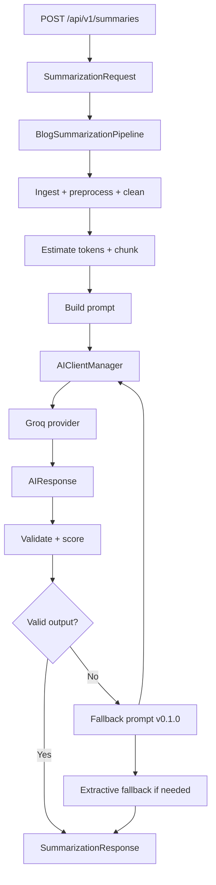
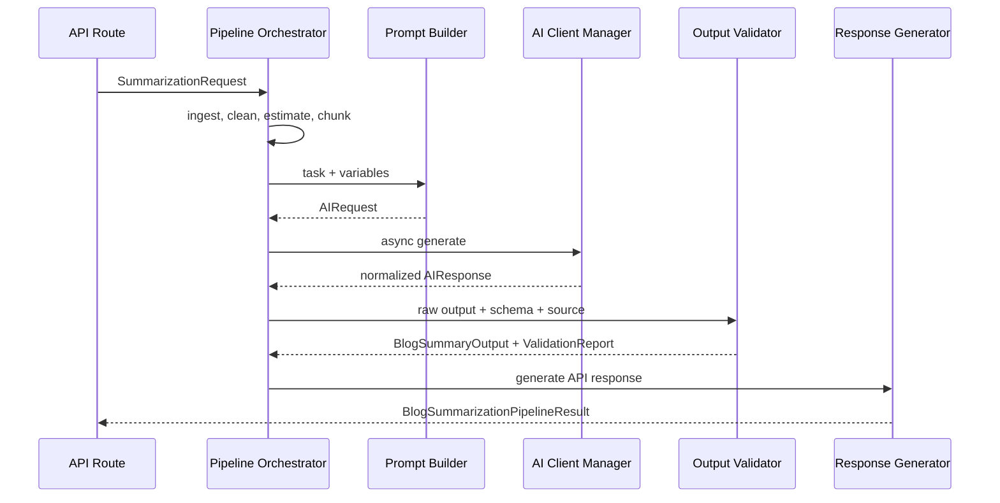

# Blog Summarizer API

Production-ready FastAPI skeleton for an AI backend service.

## Project structure

```text
app/
  ai/
    providers/
      base.py
      groq.py
    client.py
    exceptions.py
    models.py
    types.py
  prompts/
    templates/
      summarization/
        fallback.toml
        v1.toml
    builder.py
    loader.py
    registry.py
    renderer.py
    testing.py
    types.py
  guardrails/
    detectors.py
    exceptions.py
    middleware.py
    moderation.py
    risk.py
    schemas.py
    service.py
  observability/
    correlation.py
    logging.py
    metrics.py
    middleware.py
    telemetry.py
  api/
    v1/
      routes/
        health.py
        observability.py
        summarization.py
      router.py
  core/
    config.py
    logging.py
    middleware.py
  schemas/
    common.py
    health.py
    summarization.py
  services/
    summarization.py
  pipeline/
    observability.py
    orchestrator.py
    retry.py
    stages.py
    types.py
  validation/
    checks.py
    exceptions.py
    json_repair.py
    output_validator.py
    schemas.py
  main.py
main.py
```

## Run the server

```powershell
uv run uvicorn main:app --reload
```

The app runs at `http://127.0.0.1:8000`.

## Health check

```powershell
curl http://127.0.0.1:8000/api/v1/health
```

Expected response:

```json
{"status":"ok"}
```

FastAPI docs are available at `http://127.0.0.1:8000/docs`.

## Configuration

Settings are centralized in `app/core/config.py` with `pydantic-settings`.
Copy `.env.example` to `.env` and override values per environment.

Environment variables use the `APP_` prefix:

```text
APP_ENVIRONMENT="local"
APP_DEBUG=true
APP_HOST="127.0.0.1"
APP_PORT=8000
APP_API_V1_PREFIX="/api/v1"
APP_LOG_LEVEL="INFO"
APP_CORS_ORIGINS="http://localhost:3000"
APP_ALLOWED_HOSTS="127.0.0.1,localhost"
APP_AI_DEFAULT_PROVIDER="groq"
APP_AI_DEFAULT_MODEL="llama-3.1-8b-instant"
APP_AI_REQUEST_TIMEOUT_SECONDS=30
APP_AI_MAX_RETRIES=2
APP_AI_RETRY_BACKOFF_SECONDS=0.5
APP_AI_DEFAULT_TEMPERATURE=0.2
APP_AI_DEFAULT_MAX_TOKENS=1024
APP_GROQ_API_KEY=""
APP_PIPELINE_CHUNK_TARGET_TOKENS=1200
APP_PIPELINE_CHUNK_OVERLAP_TOKENS=120
APP_PIPELINE_MAX_ARTICLE_TOKENS=6000
APP_PIPELINE_ALLOW_EXTRACTIVE_FALLBACK=true
APP_SECURITY_MAX_REQUEST_BYTES=1000000
APP_SECURITY_RATE_LIMIT_REQUESTS=60
APP_SECURITY_RATE_LIMIT_WINDOW_SECONDS=60
APP_SECURITY_BLOCK_HIGH_RISK_INPUT=true
APP_SECURITY_BLOCK_HIGH_RISK_OUTPUT=false
APP_SECURITY_PROMPT_INJECTION_THRESHOLD=0.65
APP_SECURITY_MALICIOUS_INPUT_THRESHOLD=0.75
```

## Architecture notes

- Modular architecture keeps API routes, configuration, middleware, schemas, and services in separate packages so each layer can grow independently.
- Environment-based configuration avoids hard-coded runtime values and lets local, staging, and production deployments use the same code.
- API versioning under `/api/v1` protects clients from breaking changes when future API versions are added.
- Centralized settings management gives the app one typed source of truth for host, port, debug mode, CORS, logging, and route prefixes.
- Async route handlers keep the service ready for non-blocking AI calls, database access, queues, and external HTTP APIs.
- Middleware registration is centralized so cross-cutting concerns like CORS, trusted hosts, timing headers, authentication, and tracing stay out of route code.
- Logging is configured during app creation so every module can use standard Python loggers consistently.

## AI infrastructure

The AI layer is provider-neutral. Application services depend on `AIClientManager`, not on Groq directly, so future OpenAI, Claude, or Gemini adapters can be added behind the same interface.

Core interfaces:

- `BaseAIProvider`: abstract provider contract with `async generate(request)`.
- `AIRequest`: normalized prompt/messages plus optional inference config.
- `ModelConfig`: provider, model, temperature, max tokens, timeout, and response format.
- `AIResponse`: normalized provider output with content, finish reason, response id, metadata, and token usage.
- `AIClientManager`: central provider registry, model config resolver, retry handler, timeout wrapper, and inference entrypoint.

Class responsibilities:

- `app/ai/providers/groq.py`: translates normalized requests into Groq chat completion calls and normalizes Groq responses.
- `app/ai/client.py`: chooses the configured provider, applies retry/backoff policy, and shields callers from provider-specific SDKs.
- `app/ai/types.py`: defines stable request/response models shared by routes and services.
- `app/ai/exceptions.py`: provides AI-specific errors for configuration, provider failures, retryable failures, timeouts, and malformed responses.
- `app/ai/models.py`: stores model defaults and creates the app's default `ModelConfig`.

Dependency flow:

```text
API route -> service -> AIClientManager -> BaseAIProvider -> GroqProvider -> Groq SDK
                                      -> normalized AIResponse
```

Example inference lifecycle:

1. A route or service creates an `AIRequest` with `system` and `user` messages.
2. `AIClientManager.generate()` merges the request with default model settings from environment variables.
3. The manager selects the configured provider, currently `groq`.
4. The manager wraps the call with async timeout handling and exponential retry backoff.
5. `GroqProvider` calls `AsyncGroq.chat.completions.create()`.
6. The provider normalizes Groq's response into `AIResponse`.
7. The service receives content plus token usage without depending on Groq SDK response objects.

Example:

```python
from app.ai.client import get_ai_client_manager
from app.ai.types import AIMessage, AIRequest

manager = get_ai_client_manager()
response = await manager.generate(
    AIRequest(
        messages=[
            AIMessage(role="system", content="You summarize blog posts clearly."),
            AIMessage(role="user", content="Summarize this article..."),
        ]
    )
)

print(response.content)
print(response.usage.total_tokens)
```

## Prompt management

Prompts are file-backed, versioned, and separated by task under `app/prompts/templates`.
The current blog summarization task is `summarization.blog` with versions `1.0.0` and fallback `0.1.0`.

Prompt system responsibilities:

- `PromptTemplateLoader`: reads TOML prompt files and validates declared variables.
- `PromptRegistry`: indexes prompts by task and version, lists available tasks, and renders selected versions.
- `PromptBuilder`: small service-facing helper that turns task variables into `RenderedPrompt` or `AIRequest`.
- `render_prompt`: injects dynamic variables into system/user message templates.
- `PromptTester`: supports lightweight rendering tests without calling an LLM.

Example prompt variables:

```python
variables = {
    "article_text": "FastAPI lets developers build Python APIs with type hints...",
    "audience": "new developers",
    "tone": "friendly and explanatory",
    "summary_length": "medium",
    "focus_area": "plain-language explanations and next steps",
}
```

Prompt builder flow:

```text
service input -> PromptBuilder -> PromptRegistry -> PromptTemplateLoader
              -> render_prompt -> RenderedPrompt -> AIRequest -> AIClientManager
```

Example:

```python
from app.prompts.builder import PromptBuilder

builder = PromptBuilder()
request = builder.build_ai_request(
    task="summarization.blog",
    variables={
        "article_text": "FastAPI lets developers build Python APIs with type hints...",
        "audience": "new developers",
    },
)
```

The rendered request includes:

- A system prompt with summarization rules and JSON-only output requirements.
- A user prompt containing the article text.
- Metadata for `prompt_task`, `prompt_version`, and `response_format`.
- Automatic JSON response-format propagation into the AI client.

Prompt engineering practices used here:

- Keep system instructions separate from user content so the model has a stable task contract.
- Declare required and optional variables so prompt changes fail fast during rendering.
- Version prompts because prompt behavior is production behavior and should be reviewable.
- Use JSON output instructions plus provider-level `json_object` response format when available.
- Include audience, tone, length, and focus controls as explicit variables instead of rewriting prompts per use case.
- Keep fallback prompts small and robust so the service can degrade gracefully if a requested version is unavailable.
- Test rendering separately from LLM calls so prompt syntax and variable coverage can be validated cheaply.

## Schema and AI output validation

The validation layer treats model output as untrusted data. It parses, repairs when safe, validates with strict Pydantic schemas, and returns a structured report describing quality and risk.

Validator architecture:

- `app/schemas/summarization.py`: API request/response schemas and the strict `BlogSummaryOutput` AI output contract.
- `app/schemas/common.py`: request and response metadata schemas.
- `app/validation/output_validator.py`: orchestration pipeline for parsing, schema validation, completeness, confidence, and risk checks.
- `app/validation/json_repair.py`: limited JSON repair strategy for common LLM formatting mistakes.
- `app/validation/checks.py`: summary completeness, confidence scoring, hallucination heuristics, and toxicity checks.
- `app/validation/schemas.py`: validation report, risk analysis, confidence, completeness, and repair report schemas.
- `app/services/summarization.py`: converts `AIResponse` plus validation into API-ready `SummarizationResponse`.

Validation pipeline:

```text
raw AI text
  -> parse JSON
  -> attempt safe repair if parsing fails
  -> detect missing fields and weak fields
  -> validate against BlogSummaryOutput with extra fields forbidden
  -> score confidence and completeness
  -> run hallucination and toxicity heuristics
  -> return validated object plus ValidationReport
```

Response lifecycle:

```text
SummarizationRequest
  -> PromptBuilder
  -> AIClientManager
  -> AIResponse
  -> SummarizationValidationService
  -> SummarizationResponse + ValidationReport
```

Error handling strategy:

- Malformed JSON returns `valid=false` with a `malformed_json` issue and repair details.
- Repairable JSON records `json_repair.attempted=true` and `json_repair.repaired=true`.
- Missing fields are reported as `missing_field` errors before Pydantic validation.
- Pydantic validation errors are normalized into `ValidationIssue` objects.
- Hallucination and toxicity checks are warnings by default because they are heuristics, not final moderation decisions.
- Callers can opt into exception behavior with `raise_on_error=True`, which raises `OutputValidationError` carrying the full report.

Example:

```python
from app.schemas.summarization import BlogSummaryOutput
from app.validation.output_validator import AIOutputValidator

summary, report = AIOutputValidator().validate(
    raw_output='{"title":"FastAPI","summary":"...","key_points":["A","B","C"],"audience_takeaway":"...","confidence":"high"}',
    output_schema=BlogSummaryOutput,
    source_text="Original article text...",
)

if report.valid:
    print(summary.summary)
else:
    print(report.issues)
```

## Blog summarization pipeline

The summarization pipeline is an async orchestration layer that turns a raw article request into a validated response. Each stage is isolated so ingestion, cleaning, chunking, prompting, AI execution, validation, and response generation can evolve independently.

Pipeline stages:

```text
ingestion
  -> preprocessing
  -> content cleaning
  -> token estimation
  -> chunking
  -> prompt building
  -> AI execution
  -> response parsing and validation
  -> scoring
  -> response generation
```

Service responsibilities:

- `BlogSummarizationPipeline`: orchestrates the full lifecycle and owns fallback decisions.
- `PipelineObserver`: records stage timings, structured logs, errors, and request-scoped trace data.
- `IngestionStage`: converts the API request into a normalized `BlogDocument`.
- `PreprocessingStage`: normalizes encoded text and line endings.
- `ContentCleaningStage`: removes HTML tags and collapses noisy whitespace.
- `TokenEstimationStage`: estimates words, characters, and tokens before chunking.
- `ChunkingStage`: splits long content into overlapping chunks using environment-based limits.
- `PromptBuildingStage`: renders the versioned summarization prompt into an `AIRequest`.
- `AIExecutionStage`: executes async inference with retry support.
- `ValidationScoringStage`: parses, repairs, validates, scores, and risk-checks AI output.
- `ResponseGenerationStage`: blocks invalid output from becoming a successful response.
- `ExtractiveFallbackStage`: creates a low-confidence response if AI execution or validation cannot produce one.

Execution flow:



Orchestrator design:

```python
from app.pipeline.orchestrator import BlogSummarizationPipeline
from app.schemas.summarization import SummarizationRequest

result = await BlogSummarizationPipeline().run(
    SummarizationRequest(
        article_text="Long article text...",
        audience="new developers",
        summary_length="medium",
    )
)
```

Response lifecycle:



Observability and fallback behavior:

- Every stage appends a `PipelineStageTrace` with start time, finish time, duration, status, metadata, and error details.
- Structured logs use request id and stage names so traces can be correlated later with metrics or distributed tracing.
- AI execution uses retry handling on top of provider-level timeout/retry controls.
- If the primary prompt produces invalid output, the orchestrator retries with fallback prompt version `0.1.0`.
- If provider execution fails or fallback validation still cannot produce a usable response, the pipeline can return an extractive low-confidence summary when `APP_PIPELINE_ALLOW_EXTRACTIVE_FALLBACK=true`.

Endpoint:

```powershell
curl -X POST http://127.0.0.1:8000/api/v1/summaries `
  -H "Content-Type: application/json" `
  -d "{\"article_text\":\"Long article text with at least fifty characters...\",\"audience\":\"new developers\"}"
```

## AI guardrails and security

Guardrails run at three layers: HTTP middleware, input safety before prompt building, and output safety before validation/response generation. This keeps the model from becoming the only security boundary.

Guardrail architecture:

```text
SecurityMiddleware
  -> request size limit
  -> in-memory IP rate limit
  -> security headers

BlogSummarizationPipeline
  -> InputGuardrailStage
      -> prompt injection detection
      -> malicious input detection
      -> token abuse prevention
      -> content moderation hook
  -> PromptBuildingStage
  -> AIExecutionStage
  -> OutputGuardrailStage
      -> jailbreak leakage detection
      -> content moderation hook
  -> ValidationScoringStage
```

Why each guardrail matters:

- Prompt injection detection catches attempts to override system/developer instructions, reveal hidden prompts, or force tool and secret exfiltration.
- Jailbreak prevention reduces the chance that user text can change the model role, safety posture, or instruction hierarchy.
- Malicious input detection catches obvious script, SQL, shell, and credential-exfiltration patterns before prompt construction.
- Token abuse prevention protects cost, latency, and model context windows by blocking oversized inputs.
- Rate limiting prevents simple request floods and accidental runaway clients.
- Timeout protection is handled in the AI client and provider configuration so slow model calls cannot hang the service indefinitely.
- Fallback responses let the service degrade safely when AI execution, validation, or guardrails fail.
- Content filtering hooks provide one place to replace heuristics with a real moderation provider later.
- Instruction hierarchy enforcement keeps system rules in prompt templates and user content in user messages.
- AI response safety checks prevent unsafe model output from flowing directly to callers.

Risk scoring:

- Each detector returns `GuardrailFinding` objects with code, message, score, and evidence.
- Findings are combined into a `GuardrailReport` with `low`, `medium`, or `high` risk.
- Reports choose an action: `allow`, `warn`, `block`, or `fallback`.
- The pipeline includes guardrail reports in `BlogSummarizationPipelineResult.safety`.

Common AI security mistakes:

- Trusting prompt instructions alone instead of enforcing controls in code.
- Concatenating system instructions and user text into one unstructured prompt.
- Letting model output bypass schema validation and safety checks.
- Retrying policy or credential errors as though they were transient provider failures.
- Logging raw secrets or full hostile prompts in production logs.
- Relying only on keyword filters without observability, thresholds, and fallback behavior.
- Ignoring token budgets until provider errors or bills make the problem visible.

Production considerations:

- Replace in-memory rate limiting with Redis or an API gateway for multi-instance deployments.
- Replace heuristic moderation with a dedicated moderation model or policy service.
- Emit guardrail scores and stage traces to metrics/tracing systems.
- Store only redacted evidence for high-risk inputs.
- Tune thresholds with real traffic and false-positive review.
- Keep fallback responses clearly marked as low-confidence or degraded.
- Add per-user, per-tenant, and per-key limits before exposing public endpoints.

## Observability

The observability layer tracks request correlation, structured logs, pipeline timings, AI latency, token usage, retries, prompt versions, model quality, and validation failures.

Monitoring architecture:

```text
CorrelationMiddleware
  -> sets request_id and trace_id context
  -> returns X-Request-ID and X-Trace-ID headers

JsonLogFormatter
  -> emits JSON logs with request_id and trace_id

MetricsCollector
  -> counters
  -> timings
  -> gauges

AITelemetry
  -> AI latency
  -> token usage
  -> retry counts
  -> provider/model/prompt labels

EvaluationHook
  -> validation pass/fail
  -> confidence score
  -> completeness score
  -> hallucination and toxicity scores

PipelineObserver
  -> per-stage timing
  -> stage success/failure counts
  -> pipeline duration
```

Logging strategy:

- Logs are JSON so they can be shipped directly to log platforms.
- Every request gets a correlation id from `X-Request-ID` or a generated UUID.
- Pipeline logs use stable event names like `pipeline.stage.started`, `pipeline.stage.finished`, and `pipeline.stage.failed`.
- AI logs use stable event names like `ai.request.success`, `ai.request.retry`, and `ai.validation.evaluated`.
- Logs include provider, model, prompt task, prompt version, latency, token usage, retry attempt, and validation quality fields when available.

Metrics endpoint:

```powershell
curl http://127.0.0.1:8000/api/v1/observability/metrics
```

The current implementation uses an in-memory collector for development. In production, replace or mirror it with Prometheus, OpenTelemetry, Datadog, CloudWatch, or another telemetry backend.

Production debugging workflow:

1. Start with the user-facing `request_id` from response headers or error payloads.
2. Search logs by `request_id` or `trace_id`.
3. Inspect pipeline stage timings to locate slow stages.
4. Check `ai.request.retry` and `ai.request.failure` events for provider instability.
5. Compare prompt task/version, model, token usage, and latency across successful and failed requests.
6. Review `ai.validation.evaluated` logs for confidence, completeness, hallucination, toxicity, and issue counts.
7. Inspect guardrail reports when a response is degraded or blocked.
8. Use `/api/v1/observability/metrics` locally to confirm counters, timings, and quality gauges are moving as expected.

Production considerations:

- Send traces to OpenTelemetry and propagate W3C `traceparent` headers across services.
- Export metrics to Prometheus instead of keeping only in memory.
- Redact prompt/input evidence before logs leave the app.
- Add dashboards for p95/p99 latency, provider errors, retry rate, validation failure rate, token cost, and fallback rate.
- Alert on validation failure spikes, high hallucination scores, high retry volume, and sustained fallback usage.
